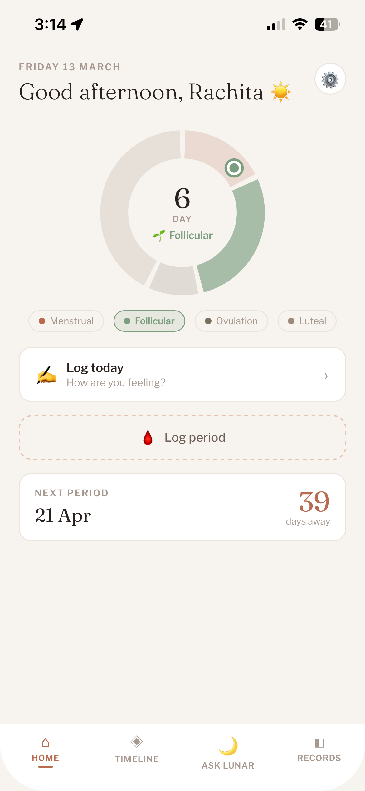
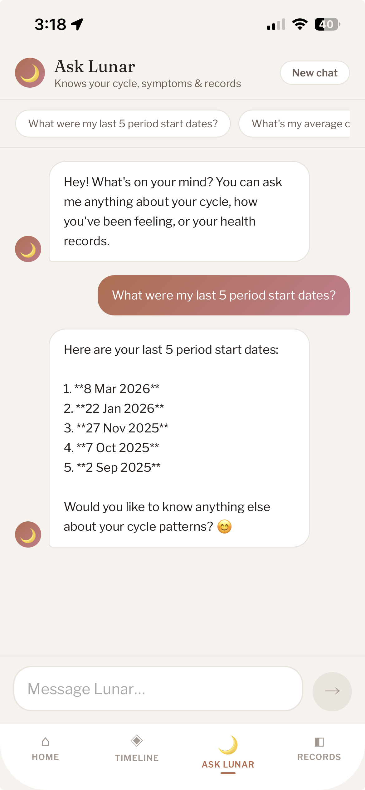

# Lunar

A personal health companion for menstrual cycle tracking, symptom logging, and AI-powered health insights.

**[lunar-app-beta.vercel.app](https://lunar-app-beta.vercel.app)**

<p align="center">
  
  &nbsp;&nbsp;&nbsp;&nbsp;
  
</p>

> More screenshots: [Timeline](docs/images/timeline.PNG) · [Records](docs/images/records.PNG)

---

## Features

- **Cycle tracking** — log period days, get predictions based on your actual history
- **Daily logging** — mood, pain, flow, symptoms, weight, notes
- **Ask Lunar** — AI assistant with access to your real cycle data and logs
- **Persistent memory** — tell Lunar something once (e.g. "I have PCOD") and it remembers across all future conversations
- **Lab report upload** — upload PDFs or images of blood reports; Claude reads them and extracts every marker automatically
- **Auto-categorisation** — reports are labelled (Hormone Panel, Thyroid, Vitamins & Minerals, General Health) based on what markers were found
- **Trend tracking** — see how each marker has changed compared to your previous report
- **Multi-file upload** — attach multiple reports at once, processed in parallel
- **Per-user data** — auth with row-level security, each user's data is private
- **PWA** — installable on iPhone via Safari, works like a native app

---

## Stack

| | |
|---|---|
| Frontend | React 19, Vite |
| Database | Supabase (Postgres) |
| Auth | Supabase Auth |
| AI | Anthropic Claude API (`claude-sonnet-4-6`) |
| Hosting | Vercel |

---

## Architecture

```
src/
  screens/     — Home, Calendar, Ask Lunar, Records
  components/  — Modals, selectors, shared UI
  hooks/       — useAuth, useLogs, usePeriodDays
  lib/         — Constants, helpers, Supabase client
api/
  ask.js       — Serverless function for Claude API calls
```

**AI context** — each request to Claude includes the user's cycle history, recent logs, and hormone data, so responses are grounded in real data rather than generic advice.

**Data isolation** — Supabase Row Level Security policies ensure users can only read and write their own rows at the database level.

---

## Local setup

```bash
git clone https://github.com/rackumar21/lunar-app
cd lunar-app
npm install
```

Add a `.env` file:

```
VITE_SUPABASE_URL=
VITE_SUPABASE_ANON_KEY=
ANTHROPIC_API_KEY=
```

```bash
npm run dev
```

---

## What I learned

- **Building for yourself is both an advantage and a blind spot.** You know exactly what you need, which makes early decisions fast. But you also have to consciously check whether the product makes sense to someone who isn't you — different cycle patterns, different health concerns, different comfort level asking an AI personal questions.
- **When AI output is wrong, the diagnosis matters more than the fix.** Is it a prompt problem, a context problem, or a model limitation? They look similar from the outside but require completely different responses. Building Lunar made me much faster at telling them apart.
- **Mobile UX has a completely different set of failure modes.** Touch targets, iOS Safari keyboard behaviour, PWA installation flows — none of this shows up when you're testing on desktop. You only catch them by using the app as an actual user on your phone every day.
